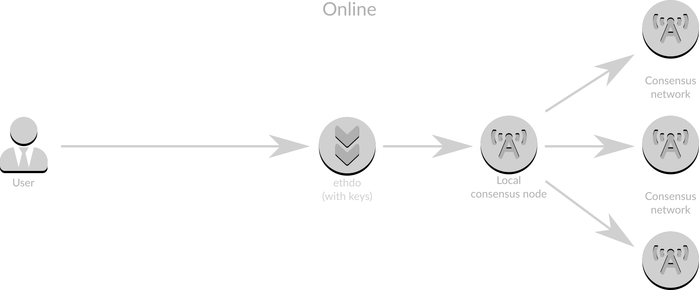
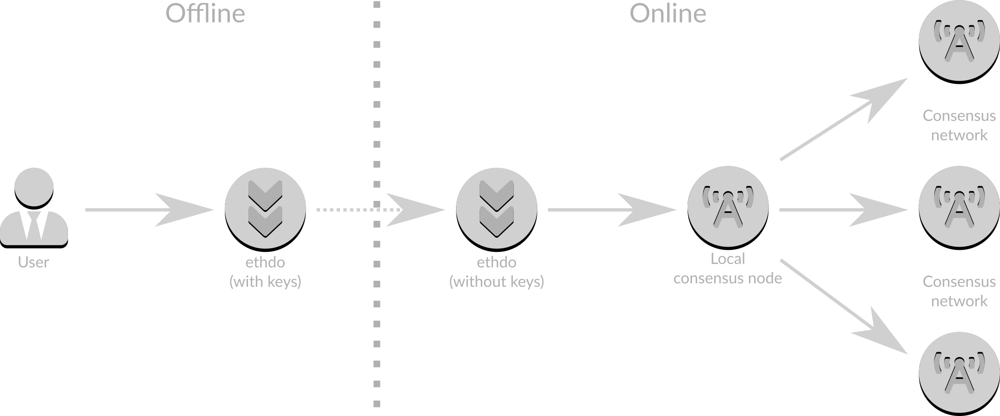

# Exiting validators
Exiting a validator relieves the validator of its duties and makes the initial deposit eligible for withdrawal.  This document provides information on how to exit one or more validators given account information.

## Concepts
The following concepts are useful when understanding the rest of this guide.

### Validator
A validator is a logical entity that secures the Ethereum beacon chain (and hence the execution chain) by proposing blocks and attesting to blocks proposed by other validators.

### Private key
A private key is a hexadecimal string (_e.g._ 0x010203…a1a2a3) that can be used to generate a public key and (in the case of the execution chain) Ethereum address.

### Mnemonic
A mnemonic is a 24-word phrase that can be used to generate multiple private keys with the use of _paths_.  Mnemonics are supported in the following languages:
* chinese simplified
* chinese traditional
* czech
* english
* french
* italian
* japanese
* korean
* spanish

### Path
A path is a string starting with "m" and containing a number of components separated by "/", for example "m/12381/3600/0/0".  The process to obtain a key from a mnemonic and path is known as "hierarchical derivation".

### Online and Offline
An _online_ computer is one that is is connected to the internet.  It should be running a consensus node connected to the larger Ethereum network.  An online computer is required to carry out the process, to obtain information from the consensus node and to broadcast your actions to the rest of the Ethereum network.

An _offline_ computer is one that is not connected to the internet.  As such, it will not be running a consensus node.  It can optionally be used in conjunction with an online computer to provide higher levels of security for your mnemonic or private key, but is less convenient because it requires manual transfer of files from the online computer to the offline computer, and back.

If you use your mnemonic when generating exit operations you should use the offline process.  If you use a private key or keystore then the online process should be safe.

With only an online computer the flow of information is roughly as follows:



Here it can be seen that a copy of `ethdo` with access to private keys connects to a consensus node with access to the internet.  Due to its connection to the internet it is possible that the computer on which `ethdo` and the consensus node runs has been compromised, and as such would expose the private keys to an attacker.

With both an offline and an online computer the flow of information is roughly as follows:



Here the copy of `ethdo` with access to private keys is on an offline computer, which protects it from being compromised via the internet.  Data is physically moved from the offline to the online computer via a USB storage key or similar, and none of the information on the online computer is sensitive.

## Preparation
Regardless of the method selected, preparation must take place on the online computer to ensure that `ethdo` can access your consensus node.  `ethdo` will attempt to find a local consensus node automatically, but if not then an explicit connection value will be required.  To find out if `ethdo` has access to the consensus node run:

```sh
ethdo node info
```

The result should be something similar to the following:

```
Syncing: false
```

Alternatively, the result may look like this:

```
No connection supplied; using mainnet public access endpoint
Syncing: false
```

which means that a local consensus node was not accessed and instead a public endpoint specifically assigned to handle these operations was used instead.  If you do have a local consensus node but see this message it means that the local node could not be accessed, usually because it is running on a non-standard port.  If this is the case for your configuration, you need to let `ethdo` know where the consensus node's REST API is.  For example, if your consensus node is serving its REST API on port 12345 then you should add `--connection=http://localhost:12345` to all `ethdo` commands in this process, for example:

```sh
ethdo --connection=http://localhost:12345 node info
```

Note that some consensus nodes may require configuration to serve their REST API.  Please refer to the documentation of your specific consensus node to enable this.

Regardless of your method used above, it is important to confirm that the "Syncing" value is "false".  If this is "true" it means that the node is currently syncing, and you will need to wait for the process to finish before proceeding.

Once the preparation is complete you should select either basic or advanced operation, depending on your requirements.

## Basic operation
Given the above concepts, the purpose of this guide is to exit one or more active validators, allowing the initial deposit to be returned.

Basic operation is suitable in the majority of cases.  If you:

- generated your validators using a mnemonic (_e.g._ using the deposit CLI or launchpad)
- want to exit all of your validators at the same time

then this method is for you.  If any of the above does not apply then please go to the "Advanced operation" section.

### Online process
The online process generates and broadcasts the operations to exit all of your validators tied to a mnemonic in a single action.

One piece of information are required for carrying out this process online: the mnemonic.

On your _online_ computer run the following:

```
ethdo validator exit --mnemonic="abandon abandon abandon … art"
```

Replacing the `mnemonic` value with your own values.  This command will:

1. obtain information from your consensus node about all currently-running validators and various additional information required to generate the operations
2. scan your mnemonic to find any validators that were generated by it, and create the operations to exit
3. broadcast the exit operations to the Ethereum network

### Online and Offline process
The online and offline process contains three steps.  In the first, data is gathered on the online computer.  In the second, the exit operations are generated on the offline computer.  In the third, the operations are broadcast on the online computer.

One piece of information are required for carrying out this process online: the mnemonic from which the validators were derived.

On your _online_ computer run the following:

```
ethdo validator exit --prepare-offline
```

This command will:

1. obtain information from your consensus node about all currently-running validators and various additional information required to generate the operations
2. write this information to a file called `offline-preparation.json`

The `offline-preparation.json` file must be copied to your _offline_ computer.  Once this has been done, on your _offline_ computer run the following:

```
ethdo validator exit --offline --mnemonic="abandon abandon abandon … art"
```

Replacing the `mnemonic` value with your own value.  This command will:

1. read the `offline-preparation.json` file to obtain information about all currently-running validators and various additional information required to generate the operations
2. scan your mnemonic to find any validators that were generated by it, and create the operations to exit
3. write this information to a file called `exit-operations.json`

The `exit-operations.json` file must be copied to your _online_ computer.  Once this has been done, on your _online_ computer run the following:

```
ethdo validator exit
```

This command will:

1. read the `exit-operations.json` file to obtain the operations to exit the validators
2. broadcast the exit operations to the Ethereum network

## Advanced operation
Advanced operation is required when any of the following conditions are met:

- your validators were created using something other than the deposit CLI or launchpad (_e.g._ `ethdo`)
- you want to exit your validators individually

### Validator reference
There are three options to reference a validator:

- the `ethdo` account of the validator (in format wallet/account)
- the validator's public key (in format 0x…)
- the validator's on-chain index (in format 123…)
- the validator's keystore, either provided directly or as a path to the keystore on the local filesystem

Any of these can be passed to the following commands with the `--validator` parameter.  You need to ensure that you have this information before starting the process.

**In the following examples we will use the validator with index 123.  Please replace this with the reference to your validator in all commands.**

### Generating exit operations
Note that if you are carrying out this process offline then you still need to carry out the first and third steps outlined in the "Basic operation" section above.  This is to ensure that the offline computer has the correct information to generate the operations, and that the operations are made available to the online computer for broadcasting to the network.

If using the online and offline process run the commands below on the offline computer, and add the `--offline` flag to the commands below.  You will need to copy the resultant `exit-operations.json` file to the online computer to broadcast to the network.

If using the online process run the commands below on the online computer.  The operation will be broadcast to the network automatically.

#### Using a mnemonic and path.
A mnemonic is a 24-word phrase from which withdrawal and validator keys are derived using a _path_.  Commonly, keys will have been generated using the path m/12381/3600/_i_/0/0, where _i_ starts at 0 for the first validator, 1 for the second validator, _etc._

however this is only a standard and not a restriction, and it is possible for users to have created validators using paths of their own choice.

```
ethdo validator exit --mnemonic="abandon abandon abandon … art" --path='m/12381/3600/0/0/0'
```

replacing the path with the path to your validator key, and all other parameters with your own values.

#### Using a mnemonic and validator.
Similar to the previous section, however instead of specifying a path instead the index, public key or account of the validator is provided.

```
ethdo validator exit --mnemonic="abandon abandon abandon … art" --validator=123
```

#### Using an account
If you used `ethdo` to create your validator you can specify the accout of the validator to generate and broadcast the exit operation with the following command:

```
ethdo validator exit --account=Wallet/Account --passphrase=secret
```

replacing the parameters with your own values.  Note that the passphrase here is the passphrsae of the validator account.

## Confirming the process has succeeded
The final step is confirming the operation has taken place.  To do so, run the following command on an online server:

```sh
ethdo validator info --validator=123
```

The result should show the state of the validator as exiting or exited.
